<div align="center">

# 🤖 XGBoost Quant Forensics Pipeline

### Two-Stage Predictive Modeling Framework


<p align="center">
  <em>A quantitative research pipeline that combines "Forensic Signal Detection" with an AI-driven "Trade Bouncer" to filter high-probability setups.</em>
</p>

</div>

---

## 📖 Overview

This project implements a **Forensic Trading Strategy**. Instead of blindly predicting every market tick, it first identifies historical reversal points (local extrema) and then trains a Machine Learning model to distinguish between "Fakeouts" and "True Reversals."

The pipeline is split into two distinct stages: **Evidence Gathering** (Stage 1) and **AI Filtering** (Stage 2).

---

## ⚙️ Pipeline Architecture

### Stage 1: The Detective (`red1.py`)

Performs a forensic audit on historical market data to build a labeled dataset.

* **Reversal Detection:** Uses `scipy.signal.argrelextrema` to pinpoint historical Local Highs and Lows.
* **Outcome Labeling:** Looks forward (60-minute window) to determine the fate of each signal:

  * `Label 1 (Good Trade)`: Price hit **1:2 Risk/Reward** Take Profit.
  * `Label 0 (Bad Trade)`: Price hit the Stop Loss.
* **Evidence Scraping:** Extracts a **25-minute "Evidence Window"** leading up to the event (RSI, MACD, BBands).
* **Output:** Clean `.parquet` files with features (Evidence) and targets (Outcome).

### Stage 2: The Bouncer (`red2.py`)

Acts as a simulation engine, using the trained XGBoost model as a gatekeeper.

* **Simulation:** Replays market history candle-by-candle (Event-Driven).
* **Signal Generation:** Identifies potential reversals in real-time.
* **Bouncer Logic:**

  1. Extracts the 25-minute evidence window for the current signal.
  2. Queries the **XGBoost Model**.
  3. **Approve:** If Model predicts `1`, execute the trade.
  4. **Reject:** If Model predicts `0`, ignore the signal.

---

## 🔄 Logic Flow

```mermaid
graph TD
    A[Raw Market Data] -->|Stage 1: Forensics| B{Find Reversals}
    B -->|Label Outcomes| C[Create Training Set]
    C -->|Train XGBoost| D[AI Bouncer Model]
    E[Live Simulation] -->|Stage 2: Backtest| F{New Signal?}
    F -->|Yes| G[Gather 25m Evidence]
    G --> H[Ask AI Bouncer]
    H -->|Prediction = 0| I[❌ Block Trade]
    H -->|Prediction = 1| J[✅ Execute Trade]
```



---

## 📂 Project Structure

```bash
xgb-quant-forensics-pipeline/
├── red1.py                 # Stage 1: Forensic Data Miner
├── red2.py                 # Stage 2: AI Backtesting Engine
├── models/                 # Saved XGBoost Models (JSON)
├── data/                   # Processed Parquet Files
└── README.md               # Documentation
```

---

## 🚀 Key Features

| Feature                     | Description                                                                          |
| :-------------------------- | :----------------------------------------------------------------------------------- |
| **🕵️ Forensic Analysis**   | Retroactively labels trades based on future outcomes (Look-Ahead for Training only). |
| **🛡️ AI Bouncer**          | Filters out ~60-70% of bad signals, improving Win Rate.                              |
| **🧠 Context Awareness**    | Analyzes behavior leading up to the signal, not just the current candle.             |
| **⚡ Vectorized Simulation** | Fast backtesting engine using Pandas and SciPy.                                      |

---

## 💻 Usage

**1. Run Forensics (Generate Data)**

```bash
python red1.py
```

Input: Raw CSV Data | Output: Labeled Parquet Files

**2. Run Backtest (Simulate AI Strategy)**

```bash
python red2.py
```

Input: Parquet Files + Trained Model | Output: PnL Report

---

⚠️ **Disclaimer**

<div align="center">
  Educational Research Code
</div>

This repository contains quantitative research code for educational purposes only.

* **Not Financial Advice:** Strategies and models are for research only.
* **Model Risk:** ML models can overfit historical data; past performance does not guarantee future results.
* **Execution Risk:** Real-world trading involves spread, slippage, and latency approximated by this simulator.

Engineered by Redouane Boundra.
